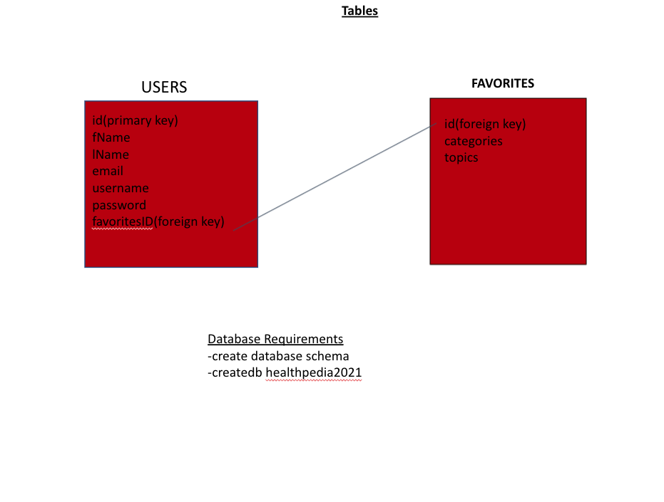
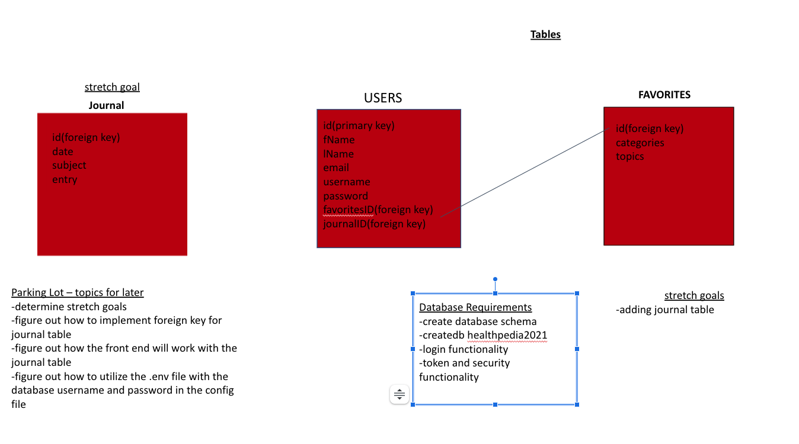

# `The Purpose of the app/website that we are building`
The purpose of the app Healthpedia is to provide a safe place where extensive research regarding top health concerns can be asked and answered quickly and efficiently. In this app we have authentication guarded sections of the app that is password and login protected. The protected section is  where the user can store and save personal attributes and heath searched topics.

# `M.V.P`

## Provide the following:

Easy to use website with login/password authentication protection
Access to client search stored in database for convenient recall
Savable Favorites according to health concerns and searches
Build out all pages with buttons working and directing to designated pages 

This project is a Full Stack application with user authentication and storage of saved favorite topics  so we focused on functionality 

# `Overview` 

This site is our full stack development capstone project for the completion of our tenure at DigitalCrafts. Our group decided to focus on a website that focuses on overall wellness. With the current climate in the world we believe that health is wealth so we created a space where people can focus on just that.
 
 

# `Tech Stack`

Languages: CSS, React, Node, expressJs Postgres SQL, Sequelize, bcryptjs, JWT,
Other: JSON, Photoshop, Postman
 
 

# `Stretch Goals (Future)`

Develop code for "forgot password" 
 
Develop personal health journal functionality for our users
 
 

# `Code Snippets` 
### Mapping API Object and capturing favorite button data for redux and database.
 
  

      
      {/* begin mapping health Data */}
          
 {healthInfo && healthInfo.map(healthInfoObj => {
            return <>
              
onClickSubject(healthInfoObj.Id, healthInfoObj.Type)}>{`${healthInfoObj.Title}\u00A0\u00A0`} 

              {yellowStar === false ? <FontAwesomeIcon icon={["fa", "star"]} className="star" onClick={()=>onClickFavorite(healthInfoObj.Id, healthInfoObj.Type, healthInfoObj.Title, yellowStar)} /> : <FontAwesomeIcon icon={["fa", "star"]} className="star active" onClick={()=>onClickRemoveFavorite(healthInfoObj.Id, healthInfoObj.Type, healthInfoObj.Title)}/>}

              

            </>;
            })}
      {/* end mapping health Data */}
          

# `Planning phase for database layout`

 ## Planning Phase 1

 
 
## Planning Phase 2

 
 
## Planning Phase Final

# `Logo` 

    

   

# `Developer Team`

## Jose Tollinchi

https://github.com/AnaIitico

Front End focus

React, Redux, Redux-Thunk, Javascipt, Postgres Integration, JWT, User Authentication

bcryptjs, Css, Html, Postman
 
 
## Syreeta Greene

Front End focus

https://github.com/Sr-GrEeNe18

Design, React, User functionality, Quality Assurance

bcryptjs, Sequelize, Js, Html, Scrum master
 
 
## Mike Williams

`Back End Focus`

https://github.com/mikej803 
Node, Postgres Integration, JS,  JWT, CSS3, Redux, Redux-Thunk, HTML5, Postman, PostgresSQL, ExpressJS, bcryptjs, Sequelize, Js, JWT, CSS3, User Authentication, Quality Assurance
 
 

## Brandon Stinson

`Back End Focus`

https://github.com/Bxpnds 
 Node, Postgres Integration, JS,  JWT, CSS3, Redux, Redux-Thunk, HTML5, Postman, PostgresSQL, ExpressJS, bcryptjs, Sequelize, Js, JWT, CSS3, User Authentication, Quality Assurance
 
 

# `Resources`

### Source of API
https://health.gov/our-work/health-literacy/consumer-health-content/free-web-content/apis-developers
### Source of used icons
https://fontawesome.com/v5.15/how-to-use/on-the-web/using-with/react

### Debugging Resource
https://stackoverflow.com/questions/64004975/how-to-add-target-blank-on-react?noredirect=1&lq=1

### Documentation Resources
https://npmjs.com/

